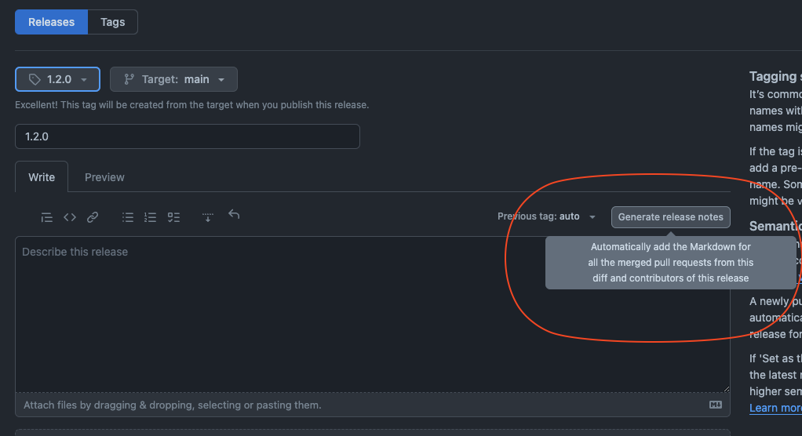
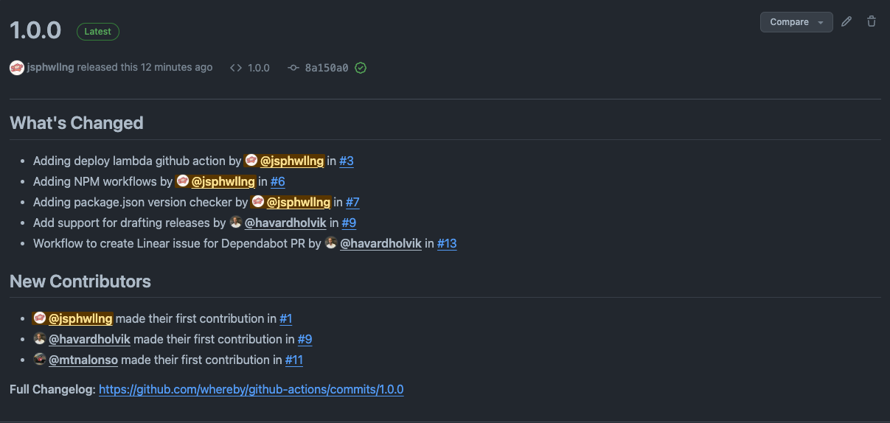

# Versioning

The github-actions repo relies on semantic versioning to allow developers to develop actions without impacting existing implementations. See [the semantic versioning](https://semver.org/) documentation. 

## Version Control

### Major Versions (X.x.x)

Major versions should be reserved for complete overhauls in the github-actions repo functionality. 

### Minor versions (x.X.x)

Minor versions involve new actions being added or the functionality of one action being changed in a backward-compatible manner.

### Patch versions (x.x.X)

Patch versions reflect, for example, the output of a particular action changing or a dependency upgrade.

## Releasing a Version

Releases should contain a detailed list of changes so that developers can decide whether or not to upgrade. This can be mostly handled via github. 

A good example of this can be seen in the `1.0.0` release:

Any breaking changes to existing actions should be indicated in the release notes.